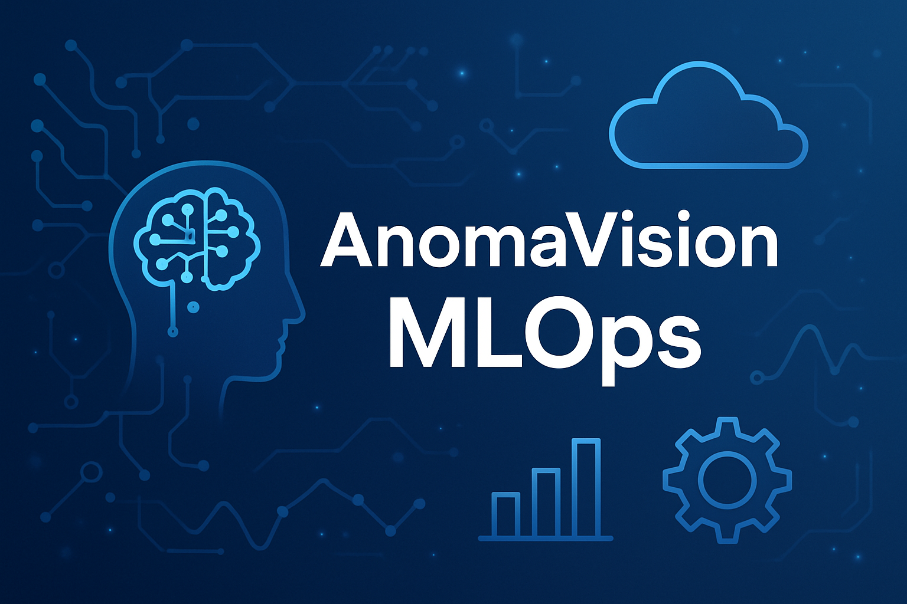

# 🤖 AnomaVision AI – Industrial-Grade MLOps Pipeline 🔥




> **A complete end-to-end MLOps system for real-time anomaly detection using FastAPI, ONNX, Azure ML, AKS, Docker & Kubernetes. Built for scalability, performance, and production-readiness.**

Whether you're a data scientist, ML engineer, or DevOps enthusiast, this repository provides a comprehensive guide to building an industrial-grade AI pipeline — from data ingestion and model training to deployment, monitoring, and optimization. It's designed to empower you with the knowledge and tools to operationalize machine learning effectively.

---

## 🎥 Inspired by Our YouTube Tutorials

This repository serves as the foundational codebase for many of our popular YouTube videos, covering a wide range of topics in **MLOps, Azure ML, FastAPI, Docker, Kubernetes (AKS), ONNX, and more**. Each component within this project is meticulously crafted to demonstrate best practices and real-world applications.

### 📺 Featured Videos

| Title                                                                                                                                 | Description                                                                                                                                                                                               |
| ------------------------------------------------------------------------------------------------------------------------------------- | --------------------------------------------------------------------------------------------------------------------------------------------------------------------------------------------------------- |
| [Azure ML & AKS MLOps Pipeline Full Course 🔥 \| Cloud Machine Learning Masterclass](https://youtu.be/XP62m_jNwgM) | Welcome to the ultimate Azure ML + AKS MLOps Masterclass! 🚀 Whether you're a beginner or seasoned ML engineer, this video walks you through building a full production-ready pipeline using Azure tools. |
| [Azure ML v2 Key Components Explained – Pipelines, Compute, Assets & More 🚀](https://youtu.be/wq1zuL39KPk)        | Master Azure Machine Learning v2 in just 10 minutes! This comprehensive guide breaks down core components essential for building industrial-grade MLOps pipelines.                                        |
| [💥 Why 85% of ML Projects FAIL \| Build Real Industrial MLOps with Azure ML](https://youtu.be/k_4GLPGVVBw)        | Discover why most ML projects never reach production and how you can avoid these pitfalls using real-world MLOps strategies on Azure ML.                                                                  |
| [🏭 Industrial MLOps Stack Setup Guide on Windows 💻 For Beginners & Pros](https://youtu.be/vlxl4iZniCI)           | Ready to build a foundation-grade MLOps environment—on Windows? Learn to level up your dev setup with this full-stack guide.                                                                              |
| [🚀 Deploy Anomaly Detection with FastAPI & Streamlit! MLOps for Beginners](https://youtu.be/GoqzmrAyMic)          | Turn your ML model into a real-time API with a Streamlit dashboard. In this beginner-friendly tutorial, deploy end-to-end anomaly detection using FastAPI and Streamlit.                                  |

Let me know if you want the real YouTube video IDs inserted into the links.
> 💡 **Want to explore more? Check out our full playlist on YouTube: [[Deep Knowledge Space]](https://www.youtube.com/playlist?list=PL-kVqysGX5170z9hCqpCtQbhwiq3hnn55)**

---

## 🧩 Project Overview

**AnomaVision AI** is a comprehensive solution for detecting anomalies in images using state-of-the-art methods like **PaDiM**, complemented by custom enhancements for industrial applications. Key aspects of this project include:

- ✅ **End-to-End ML Training & Inference:** A complete workflow from data preparation to model training and real-time inference.
- 🚀 **High-Performance Inference Service:** Built with **FastAPI** for low-latency, high-throughput anomaly detection.
- 🐳 **Containerized Deployments:** Utilizes **Docker** with multi-stage builds for lightweight and reproducible environments.
- 🌐 **Scalable Cloud Deployment:** Deploys seamlessly via **Kubernetes (AKS)** on **Azure ML** for robust and elastic scaling.
- 🧪 **Automated CI/CD Pipelines:** Powered by **Azure DevOps YAML** for continuous integration and continuous delivery, ensuring rapid and reliable updates.
- 📈 **Comprehensive Monitoring & Logging:** Integrates with **Application Insights**, **Prometheus**, and includes advanced **drift detection** capabilities.
- 💸 **Cost Optimization Strategies:** Implements techniques to significantly reduce Azure ML infrastructure costs, demonstrating savings of up to 85%.
- 🏗️ **Infrastructure as Code (IaC):** Azure resources (ACR, AKS, Azure ML Workspace, Key Vault) are provisioned programmatically using Python SDK and Azure CLI.
- 📊 **MLflow Integration:** Tracks experiments, manages model versions, and facilitates the machine learning lifecycle.
- 🔗 **Git Submodules Management:** Demonstrates best practices for managing complex, multi-repository projects.

---

## 🗂️ Project Structure

This repository is meticulously organized to facilitate understanding and collaboration. Below is a high-level overview of the main directories and their contents:

```
.
├── azure_components/       # Scripts and presentations for provisioning Azure resources (Resource Groups, Storage Accounts, ML Workspaces)
├── data/                   # Placeholder for datasets used in training and evaluation
├── deployment/             # Kubernetes and Azure ML deployment configurations and manifests
├── devops/                 # Azure DevOps pipeline definitions and environment variables
├── distributions/          # Exported models (ONNX, PyTorch) and associated metadata (e.g., model_info.json)
├── doc/                    # Comprehensive documentation, visual assets (like banner.png), and diagrams
├── docker/                 # Dockerfiles tailored for various purposes: training, inference, and lightweight builds
├── environment/            # Conda environments and Dockerfiles for setting up development and production environments
├── integration/            # End-to-end integration tests to validate system functionality
├── jobs/                   # Azure ML Jobs definitions for automated tasks such as data validation and model training
├── k8s/                    # Kubernetes manifests for deploying applications and services to AKS
├── keyvault/               # Scripts for Azure Key Vault setup and secure management of secrets
├── load_testing/           # Locust scripts for performance and stress testing of FastAPI applications
├── logs/                   # Directory for application logs
├── models/                 # Stored machine learning models
├── model_output/           # Output directory for trained models or inference results
├── monitoring/             # Scripts for Application Insights integration, drift detection, and Prometheus configuration
├── outputs/                # Output from various pipeline stages (e.g., data validation results)
├── pipelines/              # Azure DevOps YAML pipelines for CI/CD and infrastructure management
│   ├── infra/              # Infrastructure provisioning pipelines
│   └── templates/          # Reusable pipeline templates for common tasks
├── requirements/           # Python dependency files (requirements.txt, requirements_np.txt)
├── src/                    # Core application source code, including FastAPI, Streamlit, and ML logic
│   ├── AnomaVision/        # The main anomaly detection library, containing PaDiM implementation and utilities
│   └── static/             # Shared static assets for web applications
└── tests/                  # Unit tests for individual components and modules
```

---

## 🛠️ Technologies Used

This project leverages a robust stack of technologies to deliver a high-performance and scalable MLOps solution:

| Category | Tool |
|---|---|
| **ML Frameworks** | PyTorch, ONNX, Scikit-learn |
| **Inference** | FastAPI, Streamlit |
| **Containerization** | Docker, Minikube |
| **Orchestration** | Kubernetes (AKS) |
| **Cloud Platform** | Azure ML, Azure Container Registry (ACR), Azure Key Vault |
| **CI/CD** | Azure DevOps, GitHub Actions |
| **Monitoring** | Application Insights, Prometheus |
| **Data Validation** | Custom validation scripts |
| **Utilities** | Poetry, Python 3.11+, MLflow |

---

## 🚀 Getting Started

Follow these steps to set up and run the AnomaVision AI MLOps pipeline on your local machine and deploy it to Azure.

### 1. Clone the Repository

Start by cloning the repository, ensuring you also initialize and update the Git submodules, which are crucial for the `AnomaVision` library:

```bash
git clone --recurse-submodules https://github.com/DeepKnowledge1/industrial_anodet_mlops
cd anomavision
```

*Note: Replace `https://github.com/DeepKnowledge1/industrial_anodet_mlops` with the actual URL of your repository.*

### 2. Install Dependencies

This project uses `poetry` for dependency management. Install the required packages by running:

```bash
poetry install
```

### 3. Train Your Model

The `train.py` script is designed to train the anomaly detection models. It requires specifying the dataset path and the backbone network. Ensure your dataset is accessible (e.g., at `D:/01-DATA/bottle` or a similar path on your system).

```bash
python src/train.py --dataset_path "path/to/your/dataset" --backbone resnet18
```

**Key Parameters for `train.py`:**

- `--dataset_path`: **(Required)** Path to the dataset folder containing `train/good` images (e.g., `D:/01-DATA/bottle`).
- `--backbone`: **(Optional)** Backbone network for feature extraction. Choose between `resnet18` (default) or `wide_resnet50`.
- `--model_data_path`: **(Optional)** Directory to save model distributions and ONNX file (default: `./distributions/`).
- `--output_model`: **(Optional)** Output folder for model export (default: `model_output`).
- `--batch_size`: **(Optional)** Batch size for training and inference (default: `2`).
- `--layer_indices`: **(Optional)** List of layer indices to extract features from (default: `[0]`).
- `--feat_dim`: **(Optional)** Number of random feature dimensions to keep (default: `50`).
- `--mlflow_tracking_uri`: **(Optional)** MLflow tracking URI (default: `file:./mlruns`).
- `--mlflow_experiment_name`: **(Optional)** MLflow experiment name (default: `padim_anomaly_detection`).
- `--run_name`: **(Optional)** MLflow run name. If not provided, it will be auto-generated.
- `--registered_model_name`: **(Optional)** Name for the registered model in MLflow Model Registry (default: `PadimONNX`).
- `--test_dataset_path`: **(Optional)** Path to test dataset for evaluation. If not provided, it will use `dataset_path`.
- `--evaluate_model`: **(Flag)** Include this flag to evaluate the model after training.

### 4. Run FastAPI Inference Server

To run the FastAPI application locally:

```bash
uvicorn src/fastapi_app:app --reload --host 0.0.0.0 --port 8080
```

This will start the FastAPI server, typically accessible at `http://localhost:8080`.

### 5. Run Streamlit Application

To connect the Streamlit frontend with your running FastAPI backend:

```bash
streamlit run src/streamlit_app.py --server.port 8501 --server.enableCORS true --server.enableXsrfProtection false
```

Access the Streamlit application in your browser, usually at `http://localhost:8501`.

### 6. Test `score.py`

The `score.py` file is critical for model inference within Azure ML deployments. It's essential to test its functionality thoroughly before deployment.

To run the unit tests for `score.py` (assuming `test_padim.py` is an example of such a test, located in `tests/`):

```bash
pytest tests/test_padim.py
```

*Note: Ensure all necessary dependencies are installed before running tests.*

### 7. Build and Tag Docker Image

To containerize your FastAPI application, build the Docker image:

```bash
docker build -f docker/Dockerfile.np -t fastapi-anomavision:latest .
```

Then, tag the image for your container registry (e.g., Docker Hub or Azure Container Registry):

```bash
docker tag fastapi-anomavision:latest deepknowledge/fastapi-anomavision:latest
```

### 8. Deploy to AKS

For full deployment to Azure Kubernetes Service (AKS) via Azure ML, follow the instructions in the `deployment/` and `pipelines/` directories. A typical deployment command would look like:

```bash
az ml online-deployment create -n my-deployment --endpoint my-endpoint --file deployment/endpoint-k8s-config.yml
```

> 📘 For detailed setup instructions, including Azure infrastructure provisioning and Azure DevOps pipeline configurations, refer to the `/doc` folder or watch our dedicated [Getting Started Video] on YouTube.

---

## 🧪 Testing & Validation

This project emphasizes rigorous testing and validation at every stage of the MLOps pipeline:

- **Unit Tests:** `pytest tests/`
- **Integration Tests:** `pytest integration/`
- **Load Testing:** `locust -f load_testing/locustfile.py`
- **Data Validation:** `python src/data_validation.py`

---

## 📊 Monitoring & Logging

Effective monitoring and logging are crucial for maintaining healthy ML systems in production:

- **Application Logs:** Stored in `logs/application.log`
- **Metrics Collection:** Utilizes Prometheus for metrics, with visualization capabilities via Grafana.
- **Drift Detection:** Automated monitoring for model and data drift using `monitor_drift.py`.
- **Alerting:** Configured with Azure Monitor and Application Insights for proactive notifications.

---

## 🔄 CI/CD Pipelines

Automate your MLOps workflow with pre-built Azure DevOps YAML templates, covering the entire lifecycle:

- ✅ Model training and retraining
- 🧪 Unit and integration testing
- 🐳 Docker image build and push to ACR
- 🚀 Automated deployment to AKS
- 🧹 Cleanup and rollback strategies

Explore the pipeline definitions in `devops/azure-pipelines.yml` and `pipelines/*.yml`.

---

## 📦 Models & Artifacts

Key model artifacts and metadata are stored and managed as follows:

- **ONNX Models**: `models/padim_model.onnx`
- **PyTorch Models**: `models/padim_model.pt`
- **Model Information**: `distributions/model_info.json` (contains metadata about trained models)

---

## 🧑‍💻 Want to Contribute?

We welcome contributions from the community! Whether it's bug fixes, new features, documentation improvements, or tutorials — your input is valuable. Please feel free to open an issue or submit a pull request.

### 📝 Contribution Guidelines

1.  Fork the repository.
2.  Create a new feature branch (`git checkout -b feature/YourFeature`).
3.  Implement your changes, adding tests where applicable.
4.  Ensure your code adheres to the project's coding standards.
5.  Submit a pull request with a clear description of your changes.

---

## 📢 Stay Connected

Stay up-to-date with the latest developments, tutorials, and insights from our team:

- 📺 Subscribe to our [https://www.youtube.com/@DeepKnowledgeSpace]
- 🐦 Follow us on [https://x.com/KnowledgeD76945/]
- 💼 Connect with us on [https://www.linkedin.com/in/deep-knowledge/]

---

## ⭐️ Show Your Support

If you found this project useful or insightful, please consider showing your support:

- 👍 Star the repository on GitHub.
- 📢 Share it with your colleagues and network.
- 💬 Leave feedback or suggest new topics for future development.

---

## 📄 License

This project is licensed under the MIT License – see the `LICENSE` file for details.

---

> **Empowering ML Engineers to Deliver Production-Ready AI Systems – One Line at a Time.**
> Made with ❤️ by the Deep Knowledge

---


