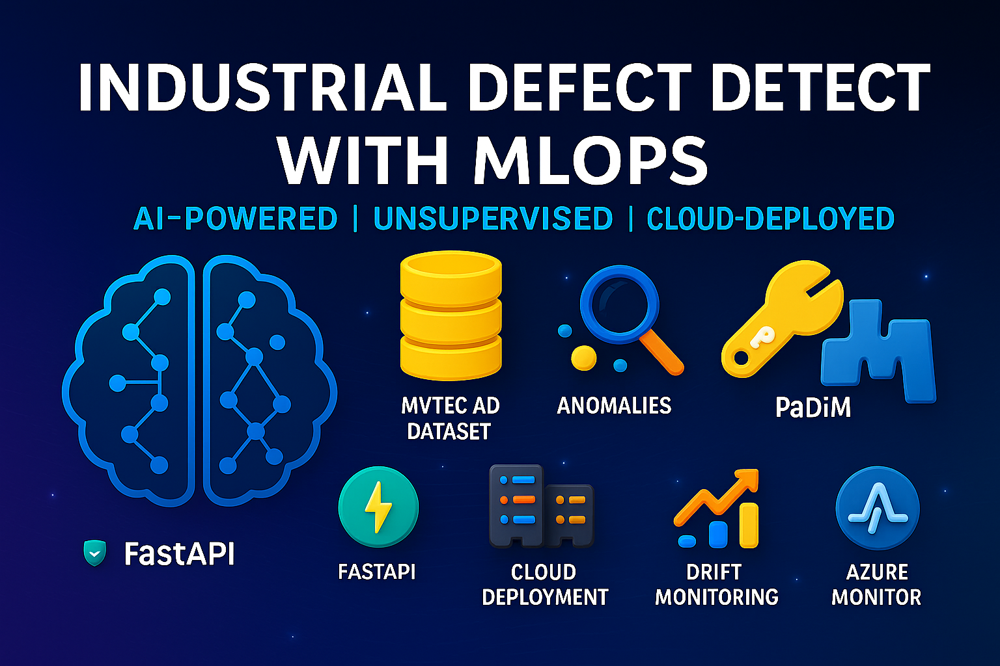

# 🏭 Industrial Defect Detection with MLOps

<center>



</center>

This repository contains a full **MLOps pipeline** for unsupervised **industrial defect detection** using **PaDiM** and a complete deployment and monitoring stack built with **FastAPI**, **Docker**, **Azure DevOps**, and **Azure Kubernetes Service (AKS)**. Environment and dependency management is handled via **Poetry**.

---

## 📁 Project Structure

```

industrial_anodet_mlops/
│
├── data/                         # Dataset (e.g., MVTec AD)
├── src/                          # Source code for training, inference, and monitoring
│   ├── model/                    # PaDiM implementation and helpers
│   ├── train.py                  # Training script
│   ├── inference.py              # Inference pipeline
│   ├── fastapi\_app.py            # FastAPI server
│   ├── logger.py                 # Logging setup
│   ├── monitor\_drift.py          # Drift detection
│   └── metrics\_logger.py         # Metric logging
│
├── deployment/                   # Azure ML deployment configuration
├── pipelines/                    # Azure DevOps ML pipelines
├── docker/                       # Dockerfiles for train/infer
├── devops/                       # Azure DevOps pipeline templates
├── monitoring/                   # Drift and performance monitoring scripts
├── keyvault/                     # Azure Key Vault integration
├── load\_testing/                 # Load testing (Locust)
├── pyproject.toml                # Poetry configuration
├── README.md                     # You're here
└── .gitignore

````

---

## 🧠 Model

The primary model implemented is **PaDiM (Patch Distribution Modeling)** for **unsupervised anomaly detection** in industrial imaging (e.g., manufacturing). It can be extended to include other vision-based models such as YOLO or FastFlow.

---

## 📦 Setup (via Poetry)

### 🧰 Prerequisites

- Python 3.11.0
- [Poetry](https://python-poetry.org/docs/#installation)
- Docker (for containerized training/inference)
- Azure CLI (for deployment)

### 📥 Install Dependencies

```bash
git clone https://github.com/DeepKnowledge1/industrial_anodet_mlops.git
cd industrial_anodet_mlops

# Install with poetry
poetry install
````

### ▶️ Activate Virtual Environment

```bash
poetry shell
```

---

## 🛠️ Usage

### ✅ Train the Model

```bash
poetry run python src/train.py --config configs/train_config.yaml
```

### 🔍 Run Inference Locally

```bash
poetry run python src/inference.py --image_path examples/example_1.png
```

### 🌐 Serve via FastAPI

```bash
poetry run uvicorn src.fastapi_app:app --reload --port 8000
```

Then navigate to:
📎 `http://localhost:8000/docs` for the interactive Swagger UI.

---

## 🐳 Docker (Train/Inference)

### Build Image

```bash
docker build -f docker/Dockerfile.inference -t defect-inference .
```

### Run Container

```bash
docker run -p 8000:8000 defect-inference
```

---

## ☁️ Azure Deployment

Scripts and templates are provided under the `deployment/` directory for deploying to **Azure ML** and **AKS**.

```bash
az login
az ml environment create -f deployment/environment.yml
az ml online-endpoint create -f deployment/deployment.yml
```

---

## 📈 Monitoring & Drift Detection

Set up Azure App Insights and drift alerting:

```bash
poetry run python monitoring/app_insights_setup.py
poetry run python monitoring/drift_alert_setup.py
```

---

## 🔐 Azure Key Vault Integration

Store and retrieve secrets securely:

```bash
poetry run python keyvault/setup_keyvault.py
```

Secrets config: `keyvault/secrets_template.json`

---

## 🔄 MLOps Pipelines (Azure DevOps)

* `pipelines/train_pipeline.yml`: Train model
* `pipelines/deploy_pipeline.yml`: Deploy to AKS
* `pipelines/retrain_pipeline.yml`: Retrain on drift detection

Use `devops/azure-pipelines.yml` as the root pipeline definition.

---

## ⚡ Load Testing

```bash
poetry run locust -f load_testing/locustfile.py
```

---

## 🧪 Testing

(Coming Soon) Unit and integration tests will be added under a `tests/` directory.

---

## 🤝 Contributing

I welcome pull requests! Before submitting, ensure:

* Code follows [PEP8](https://peps.python.org/pep-0008/)
* Proper docstrings and typing
* Tests (if applicable)

---

## 📜 License

This project is licensed under the **MIT License**.

---

## 📚 References

* [PaDiM Paper](https://arxiv.org/abs/2011.08785)
* [MVTec AD Dataset](https://www.mvtec.com/company/research/datasets/mvtec-ad)
* [Azure ML Docs](https://learn.microsoft.com/en-us/azure/machine-learning/)
